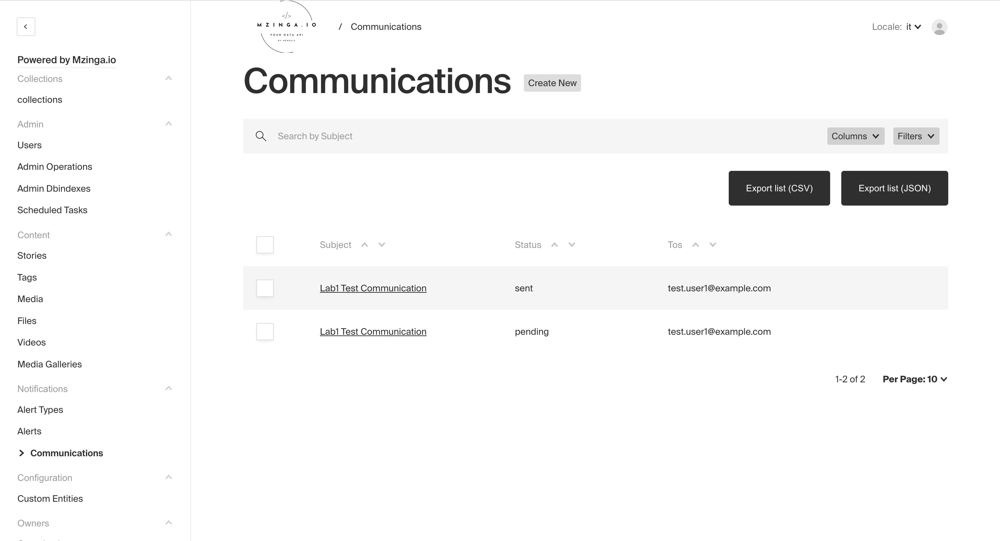
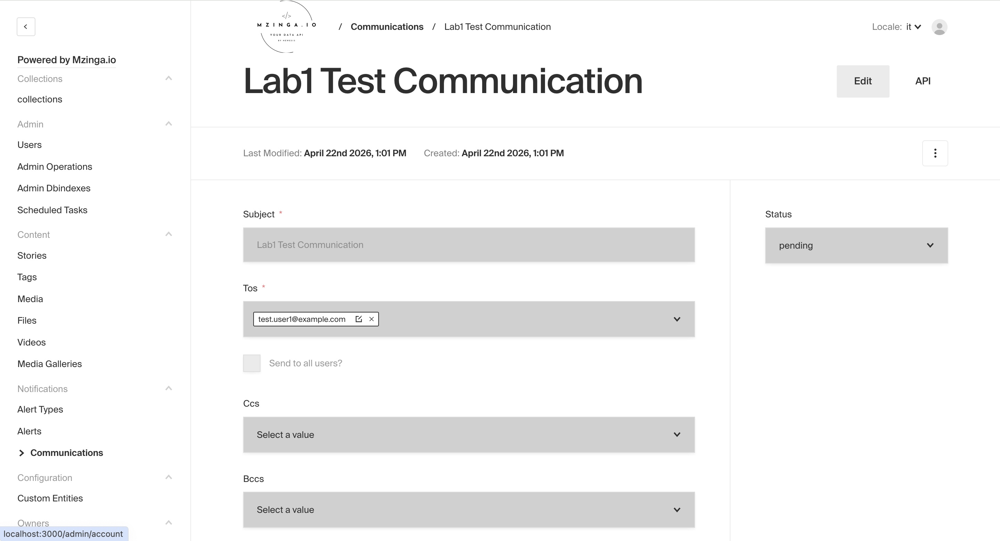
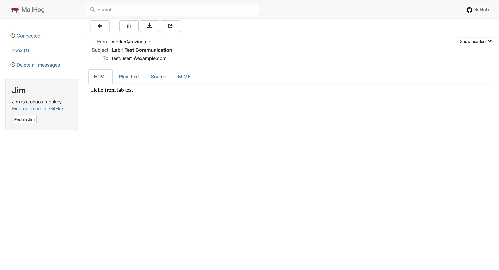

## [Lab 1 — Step 2.3] Inspect the MongoDB document shape

`db.communications.findOne()`:
```bash
db.communications.findOne()
{
  _id: ObjectId('69e895f8f91d95bc9349da35'),
  subject: 'Lab1 Test Communication',
  tos: [ { relationTo: 'users', value: '69e8951ef91d95bc9349da1b' } ],
  body: [ { children: [ { text: 'Hello from lab test' } ] } ],
  createdAt: ISODate('2026-04-22T09:33:44.135Z'),
  updatedAt: ISODate('2026-04-22T09:33:44.234Z'),
  __v: 0
}
```
> Note: In this example, optional fields such as `ccs`, `bccs`, and `sendToAll` are not present because they were not set.

`db.users.findOne({}, { email: 1 })`:
```bash
db.users.findOne({}, { email: 1 })
{
  _id: ObjectId('69e894fbf91d95bc9349d9fe'),
  email: 'admin.local@example.com'
}
```

## [Lab 1 — Step 4.3] Verify the flag works

`COMMUNICATIONS_EXTERNAL_WORKER=true`:


`COMMUNICATIONS_EXTERNAL_WORKER=false`:
```bash
[MailUtils:message] {
  "from": "info@mzinga.io",
  "subject": "Lab1 Test Communication",
  "to": "test.user1@example.com",
  "html": "<p><span>Hello from lab test</span></p>"
}

[MailUtils:result] {
  "accepted": ["test.user1@example.com"],
  "response": "250 Accepted"
}
```


## [Lab 1 — Step 6] End-to-end verification

Before refresh (after saving):


```bash
No pending documents found. Waiting 5s...
Document claimed: 69e8aa562c791125acaa4acf
Document 69e8aa562c791125acaa4acf sent successfully
No pending documents found. Waiting 5s...
```

After refresh (after worker processing):





