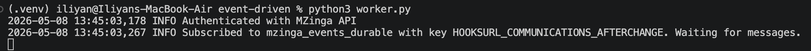
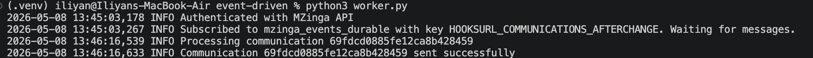
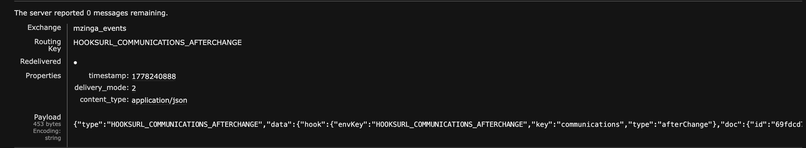
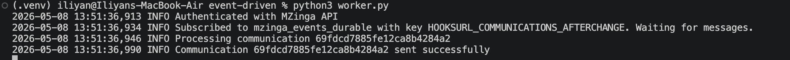
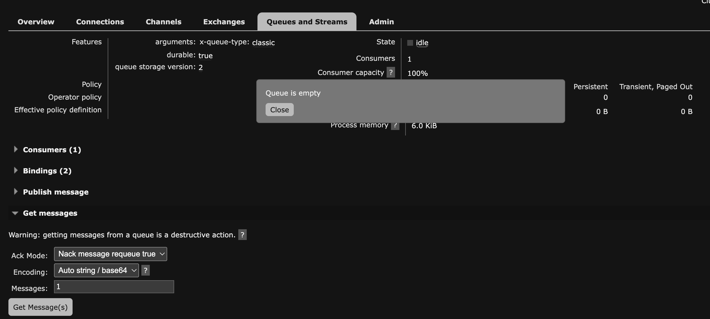

## [Lab 2 - Step B5]
For more details inspect `worker.py`

### Event-driven worker started

### Message created from Admin UI

### Worker terminal output, message processed immediately

### New message sent, after stopped the worker, and it's waiting in the queue

### Event-driven worker started again

### Queue now empty
