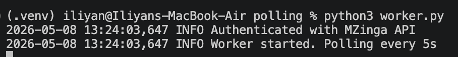
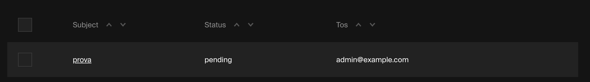
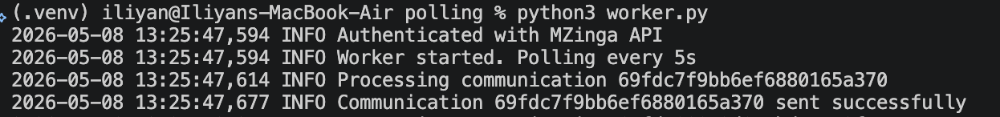
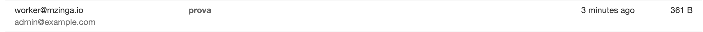

## [Lab 2 - Step A4] 
For more details inspect `worker.py`

### REST API worker started

### Created a communication document with status pending

### Worker polls the document and sends the email

### Confirm from Admin UI the status

### Confirm the email from MailHog

